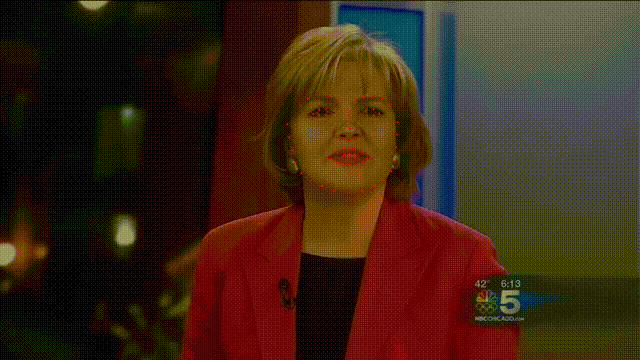
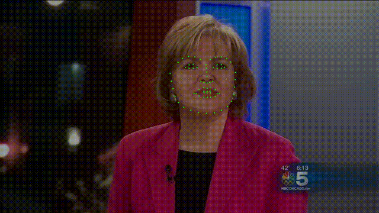

# LRNet

### 效果

- origin
 


- before modified

 

- after modified

 


### 文件结构

-   LRNet
    -   input 	存放视频数据
    -   output_landmarks	存放提取的landmarks.txt文件
    -   visualize	存放landmarks的原视频可视化与矫正视频可视化
    -   training 	训练模型
    -   model_weights 模型参数
        -   deeper	Deeperforensics-1.0数据
        -   ff	FaceForensic++数据
    -   classify.py    分类脚本
    -   extract_landmarks.py    特征提取

### 使用流程：

#### 1.环境配置：

-   TensorFlow >2.0

-   argparse

-   numpy

-   python-opencv

-   tqdm

-   imutils

-   dlib(去官网查看安装教程)

    [轮廓点检测模型下载链接](http://dlib.net/files/)

#### 2.特征提取

```python
python extract_landmarks.py
# 可以使用 -h 查看输入参数
# 默认提取input文件夹中所有视频的特征，结果默认保存到output_landmarks文件夹
# -v 可以将特征可视化结果保存到visualization文件夹
```

#### 3.分类

```python
python extract_landmarks.py
# 可以使用 -h 查看输入参数
# 默认分类output_landmarks文件夹的txt文件
# 可用 -i 指定输入文件夹
```

